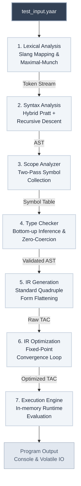

# 🚀 YaarScript: an Urdu-Slang Multi-phase Compiler

[](https://yaarscript.netlify.app/)
[](https://rustup.rs/)
[](#)
[](#)

> **YaarScript** is an educational passion project I built as a solo developer. It is a full-fledged, multi-phase compiler written in Rust, designed to demonstrate advanced compiler construction techniques, such as semantic analysis, intermediate representation optimization, and bytecode execution, while utilizing a uniquely fun, Urdu-infused slang syntax to make learning systems programming more relatable and engaging.

## 📋 Table of Contents

- [Features](#features)
- [Repository Structure](#repository-structure)
- [Architecture & Compilation Pipeline](#architecture--compilation-pipeline)
- [Urdu Slang Keywords](#urdu-slang-keywords)
- [Operator Precedence](#operator-precedence)
- [Code Examples](#code-examples)
- [Building & Running](#building--running)

---

## Features

YaarScript offers a rich set of capabilities designed for both educational clarity and compiler robustness:

- **Urdu-Slang Localization**: Code in your native tongue using expressive keywords like `yaar` (main), `faisla` (bool), and `bolo` (print).
- **Exponentiation Power**: Native support for the `**` operator, complete with strict mathematical associativity and high binding precedence (Precedence 9).
- **System Intrinsics**: First-class system calls including `suno()` (read standard input), `waqt()` (UNIX timestamp), and `ittifaq(min,max)` (randomness).
- **Strict Typing Engine**: A Zero-Coercion Policy that guarantees robust code execution by strictly validating data type consistency across all abstract syntax branches.
- **Fixed-Point Optimizer**: A Multi-Pass Intermediate Representation (IR) engine resolving variables via Constant Folding, Value Propagation, and aggressive Dead Code Elimination (DCE).
- **Direct Execution Backend**: Replaces sluggish interpreters by compiling logic into flat Three-Address Code (TAC) and executing the optimized instructions.

---

## Repository Structure

The project code is organized to reflect the modular nature of a modern compiler.

* **`docs/`**: Contains in-depth architectural Markdown guides for every single compiler phase (e.g., `LEXER.md`, `PARSER.md`, `IR_OPTIMIZATION.md`).
* **`tests/`**: Contains rigorous test cases (`.yaar` files) split into categories like `type`, `scope`, and `ir-generation` to validate compiler correctness.
* **`test_input.yaar`**: The default scratchpad file evaluated by the compiler via `cargo run`.
* **`src/`**: The core source code of the YaarScript compiler, logically separated by semantic phases:

### `src/` Architecture Overview
| Module / File | Description & Purpose |
| :--- | :--- |
| **`lexer/`** | The front-end scanner. Uses Maximal-Munch logic to tokenize UTF-8 text into language primitives. |
| 📁 **`parser/`** | The Syntax Engine. Uses a mix of Recursive Descent (control flow) and Pratt Parsing (expressions). |
| 📁 **`core/`** | Fundamental data structures, including the AST (Abstract Syntax Tree) nodes and `Token` enums. |
| 📁 **`semantics/`** | The Middle-End validators. Contains `scope.rs` (Symbol Table) and `type_checker.rs` (Zero-Coercion logic). |
| 📁 **`ir_pipeline/`** | The Optimizer. Contains `tac.rs` (Three-Address Code Generation) and `tac_optimizer.rs` (Fixed-Point Convergence loop). |
| 📁 **`codegen/`** | The Execution Engine Runtime. Interprets the generated TAC instructions and handles system intrinsics. |
| 📄 **`error.rs`** | Centralized, formatted, compiler-wide error reporting structures. |
| 📄 **`main.rs`** | The CLI entry point that orchestrates the file reading and the pipeline sequence. |
| 📄 **`lib.rs`** | Public module exports. |

---

## Architecture & Compilation Pipeline

YaarScript follows an industrial-grade multi-phase compilation architecture, lowered into an optimized linear Intermediate Representation (IR) before execution.



The transformation process begins with **Lexical Analysis**, which uses a greedy Maximal-Munch algorithm to map raw source text (including Urdu slang) into prioritized compiler primitives. This token stream is processed by the **Parser** via a Hybrid Model, combining Recursive Descent with Pratt Parsing’s Nud/Led dispatch, to build a structured **Abstract Syntax Tree (AST)**. 

During **Semantic Analysis**, the **Scope Analyzer** performs Two-Pass Symbol Collection using a LIFO stack to enforce lexical scoping, while the **Type Checker** applies a strict Zero-Coercion Policy to ensure binary compatibility across the tree. The validated AST is then lowered by the **TAC Generator** into **Three-Address Code (TAC)** in Standard Quadruple Form. Finally, the **IR Optimizer** achieves efficiency through a Fixed-Point Convergence Model, applying constant folding and Mark-and-Sweep dead code elimination.

> [!TIP]
> **Detailed Implementation Guides:**
> * **Lexer:** [Slang normalization & Maximal-Munch](./docs/LEXER.md)
> * **Parser:** [Nud/Led dispatch & EBNF grammar](./docs/PARSER.md)
> * **Scope Analyzer:** [LIFO stack & symbol collection](./docs/SCOPE_ANALYZER.md)
> * **Type Checker:** [Bottom-up inference & strict casting](./docs/TYPE_ANALYZER.md)
> * **TAC Generator:** [Control flow lowering & intrinsics](./docs/TAC_GENERATION.md)
> * **IR Optimizer:** [Mark-and-Sweep & convergence effects](./docs/IR_OPTIMIZATION.md)
---

## Urdu Slang Keywords

YaarScript Maps localized terminology directly to robust systems logic.

| YaarScript Keyword | C-Equivalent | Purpose |
|--------------------|--------------|---------|
| `number` | `int64_t` | 64-bit signed integer |
| `float` | `double` | 64-bit floating point |
| `faisla` | `bool` | Boolean value |
| `lafz` | `char*` | String primitive |
| `khaali` | `void` | No return value |
| `pakka` | `const` | Immutable constant |
| `yaar` | `main` | Entry point block |
| `agar` | `if` | Conditional branch |
| `warna` | `else` | Alternative branch |
| `jabtak` | `while` | Loop continuation |
| `dohrao` | `for` | Iterative loop |
| `intekhab` | `switch` | Multi-way branching |
| `bas_kar` | `break` | Scope exit |
| `wapsi` | `return` | Function return |
| `qism` | `enum` | Enumeration type |
| `bolo` | `printf` | Console Output |
| `suno` | `scanf` | Console Input |
| `sahi` | `true` | Boolean true |
| `galat` | `false` | Boolean false |

---

## Operator Precedence

The parser natively incorporates the **Power Operator** with high precedence.

| Level | Operators | Associativity | Example |
|-------|-----------|---------------|---------|
| 1 | `=` | Right-to-left | `a = b = c` |
| 2 | `\|\|` | Left-to-right | `a \|\| b` |
| 3 | `&&` | Left-to-right | `a && b` |
| 4 | `==`, `!=` | Left-to-right | `a == b` |
| 5 | `<`, `>`, `<=`, `>=` | Left-to-right | `a < b` |
| 6 | `&`, `\|`, `^`, `<<`, `>>` | Left-to-right | `a & b` |
| 7 | `+`, `-` | Left-to-right | `a + b` |
| 8 | `*`, `/`, `%` | Left-to-right | `a * b` |
| 9 | **`**` (Power)** | **Left-to-right** | `a ** b` |
| 10 | `-`, `!`, `++`, `--` (prefix) | Right-to-left | `!-x` |
| 11 | `++`, `--` (postfix) | Left-to-right | `x++` |
| 12 | `()` | Highest | `f(x)` |

---

## Code Examples

### ✅ Correct Code Snippet (from `tests/type/valid.yaar`)

```rust
yaar {
    number w = 10;
    number h = 20;

    dohrao (number i = 0; i < 5; i++) {
        agar (i == 3) {
            bas_kar; 
        }
    }

    faisla flag = (w > 5) && (h < 50);
    faisla check = !flag;
    
    number result = w ** 2; // Power operator test
    bolo("Computed successfully! ", result);
}
```

**Expected Output:**
```text
0
1
2
Computed successfully! 100
```

### ❌ Incorrect Code Snippet (from `tests/type/error.yaar`)

Shows strict type safety catching errors before execution.

```rust
khaali invalidVar; // ERROR: 1. ErroneousVarDecl

khaali voidFunc() {
    bolo("hello");
}

yaar {
    number i = 10;
    float f = 3.14;
    
    // 3. FnCallParamType
    voidFunc(f); 
    
    // 5. ExpressionTypeMismatch
    i = 3.14; 
    
    // 7. NonBooleanCondStmt
    agar (i) { 
        bolo("wont work");
    }
}
```

**Compiler Output (Caught at Semantic Stage):**
```text
[Type Error] Variable invalidVar cannot be of type void
[Type Error] Function 'voidFunc' expects 0 arguments, but got 1
[Type Error] Invalid assignment: Cannot assign type 'float' to variable 'i' of type 'int'
[Type Error] Condition must be a boolean expression
```

---

## Building & Running

### System Prerequisites
To run YaarScript, you need the Rust toolchain installed.
- [Rust Programming Language](https://www.rust-lang.org/tools/install) (2024 Edition recommended)
- **Cargo** (Rust's built-in package manager)

### Installation
Clone the repository and enter the directory:
```bash
git clone https://github.com/your-username/yaarscript.git
cd yaarscript
```

### Building the Compiler
To build the compiler with maximum performance out of the Fixed-Point Optimizer, compile using the `--release` flag:
```bash
cargo build --release
```

### Running the Default Scratchpad
We maintain a root-level `test_input.yaar` file that acts as a live scratchpad. Write your Urdu-slang code in there and execute the compiler using:
```bash
cargo run
```
*Alternatively, specify the target file directly:*
```bash
cargo run -- test_input.yaar
```

### Running the Test Suites
To verify that the type checker and semantic analyzer are functioning properly, you can test specific validation scripts from the `tests/` directory:
```bash
# Test a completely valid program
cargo run -- tests/type/valid.yaar

# Test the compiler's ability to catch semantic typing errors
cargo run -- tests/type/error.yaar
```